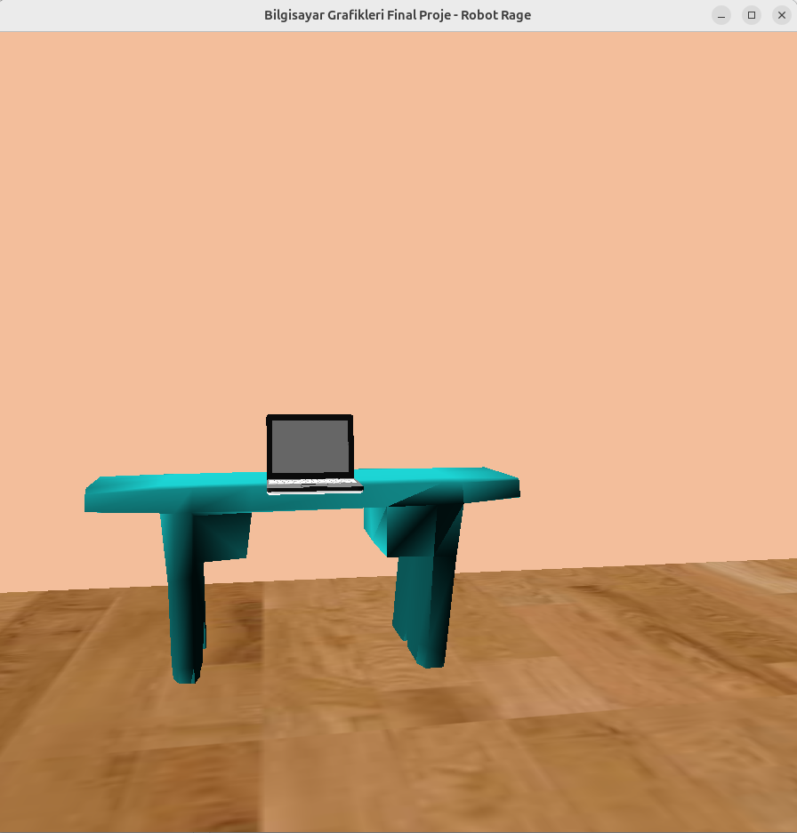
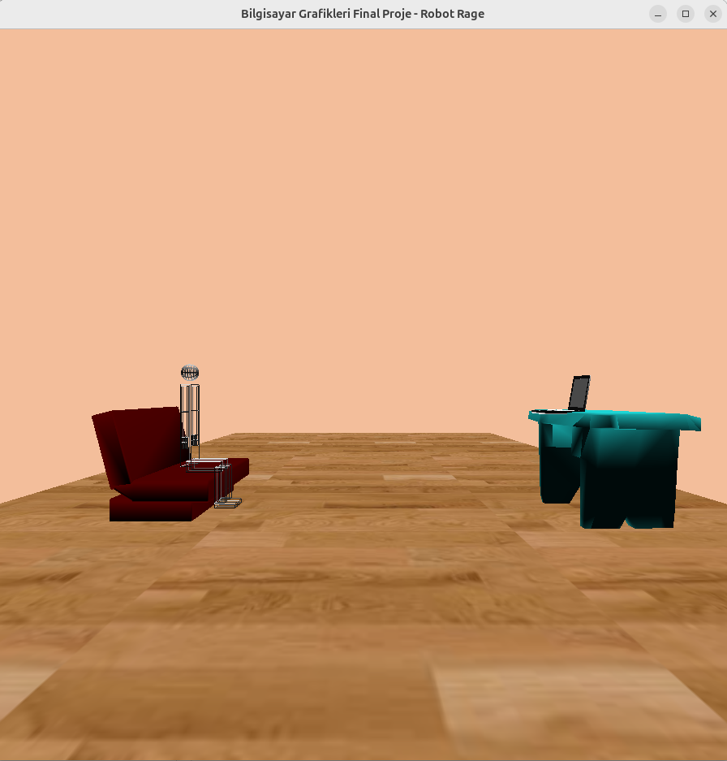
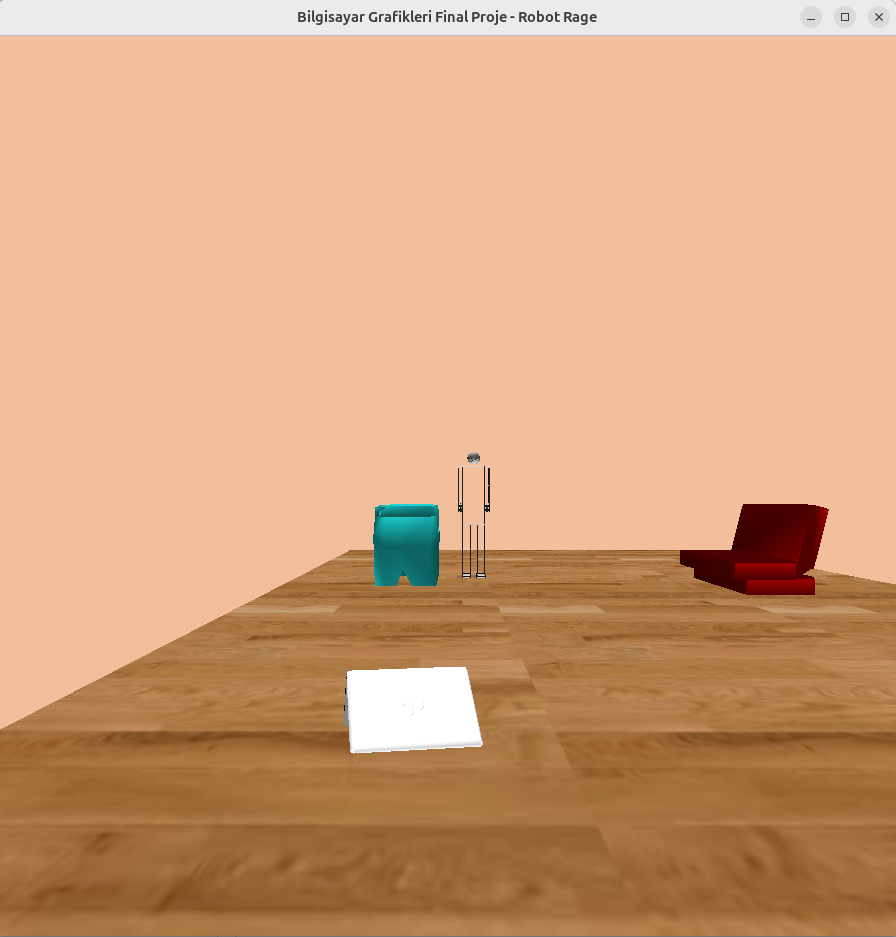
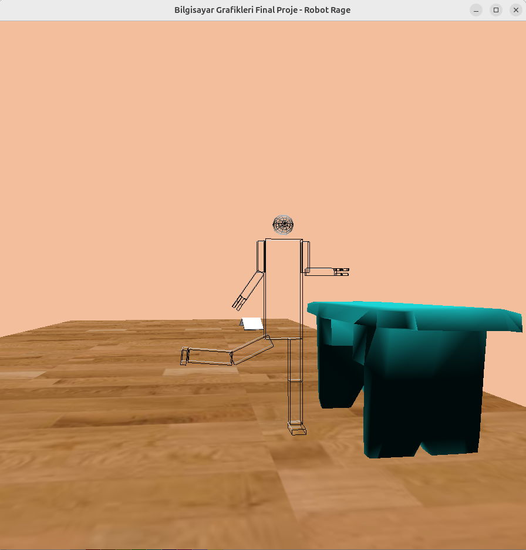

# Bilgisayar Grafikleri Final Projesi

Bu proje, Bilgisayar Grafikleri dersi kapsamında geliştirilen bir final çalışmasıdır. OpenGL kullanılarak hazırlanan sahnede bir robotun çeşitli hareketleri, obje etkileşimleri ve animasyonlar yer almaktadır.

Proje Videosu:

## Proje Özellikleri

- Sahnede bir **zemin (floor)** yer almakta ve bu zemine üç farklı **texture (doku)** uygulanmıştır.
- **Sağ tıklama menüsü** ile bu dokular arasında geçiş yapılabilir.
- Başlangıçta koltukta oturan bir **robot**, belirli tuşlarla **masa üstündeki laptopa doğru yürür** ve başka bir tuşla **laptopu alıp yere fırlatır**.
- Robotun kol, dirsek, bacak gibi uzuvları klavye tuşlarıyla kontrol edilebilir.
- Zemine doku kaplama uygulanmış, sahneye **ambient, diffuse ve specular** olmak üzere üç farklı ışık kaynağı eklenmiştir.

---

## 🛠️ Kurulum ve Çalıştırma

Projeyi bilgisayarınıza indirin

```
git clone <>
cd <>
```

Projeyi derleyin

```
g++ -o main main.cpp imageloader.cpp glm.cpp -lGL -lGLU -lglut -lm
```

ve ardından çalıştırın

```
./main
```

## ⌨️ Klavye Tuşları

|    Tuş    | İşlev                |
| :-------: | :------------------- |
|    `m`    | Robot ileri yürür    |
|    `n`    | Obje ile etkileşim   |
|    `0`    | Resetleme            |
|    `+`    | Geri gitme           |
|    `-`    | İleri gitme          |
|     ←     | Sola dön             |
|     →     | Sağa dön             |
|     ↑     | Yukarı bak           |
|     ↓     | Aşağı bak            |
| `a` / `A` | Sağ kol hareketi     |
| `w` / `W` | Sağ dirsek hareketi  |
| `s` / `S` | Sol kol hareketi     |
| `e` / `E` | Sol dirsek hareketi  |
| `d` / `D` | Sağ bacak (Z ekseni) |
| `r` / `R` | Sağ diz (Z ekseni)   |
| `f` / `F` | Sol bacak (Z ekseni) |
| `t` / `T` | Sol diz (Z ekseni)   |
| `z` / `Z` | Sağ diz (X ekseni)   |
| `x` / `X` | Sağ bacak (X ekseni) |
| `c` / `C` | Sol bacak (X ekseni) |
| `v` / `V` | Sol diz (X ekseni)   |

## 🖼️ Ekran Görüntüleri




